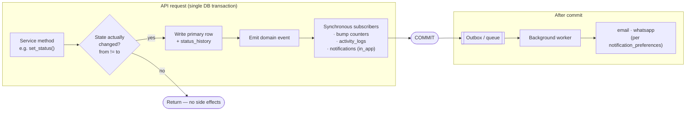
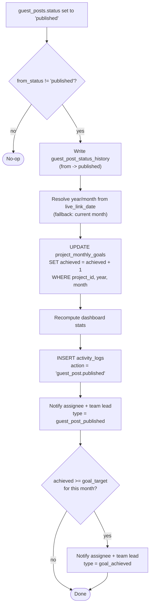
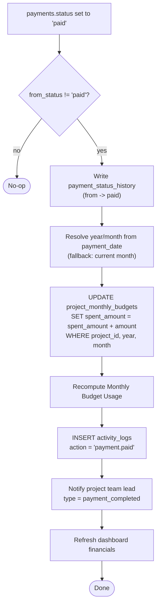
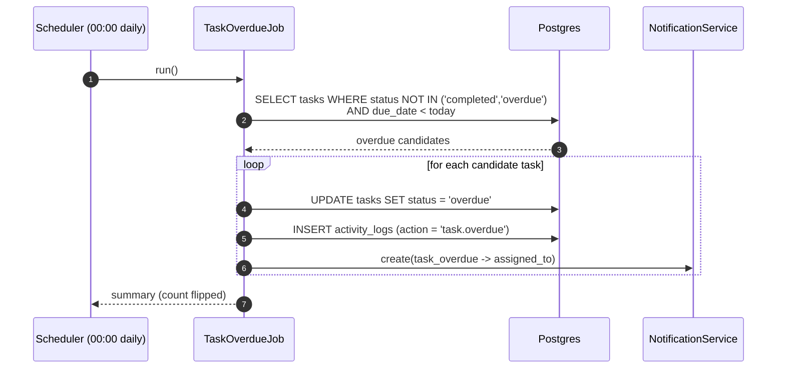
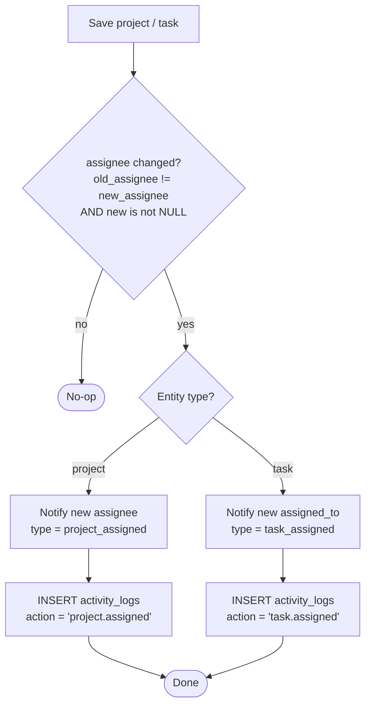
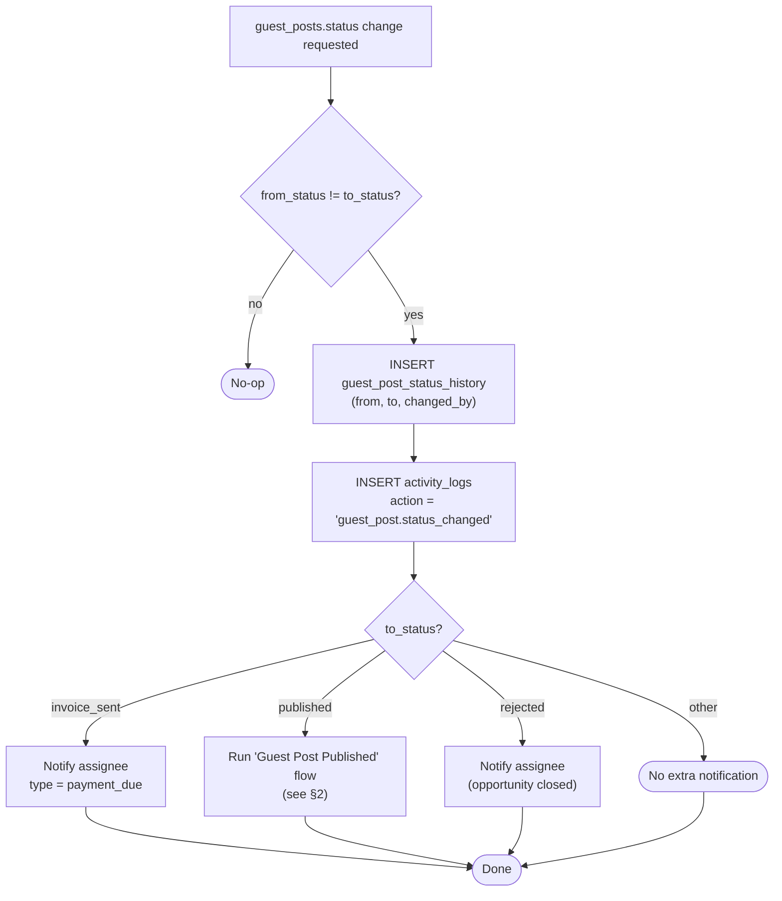
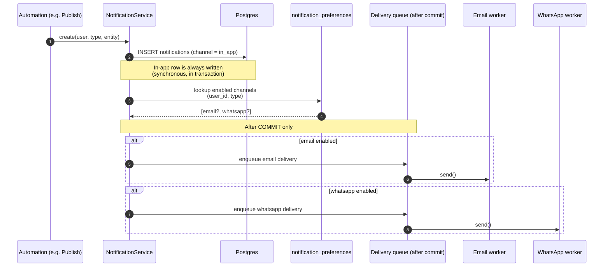

# Automation Flows — Digital Leap GPOMS

> **Status:** Planning deliverable · **Audience:** Backend engineers, reviewers · **Last updated:** 2026-06-05

This document specifies the automated workflows that drive the **Guest Post Operations Management System (GPOMS)**. GPOMS keeps three denormalised, fast-read surfaces in sync with the operational data: **monthly goal progress** (`project_monthly_goals.achieved`), **monthly budget consumption** (`project_monthly_budgets.spent_amount`), and the user-facing **notifications** + **activity audit trail**. Rather than recomputing these on every read, the service layer reacts to *domain events* — a guest post going live, a payment clearing, a task falling overdue — and applies the side effects transactionally. This keeps dashboards instant, the audit log complete, and the team informed without manual bookkeeping.

The diagrams below use [Mermaid](https://mermaid.js.org/) and render natively in GitHub, GitLab, and most Markdown viewers. Table and column names match `docs/database/schema.sql` exactly.

---

## Table of Contents

1. [Automation Engine](#1-automation-engine)
2. [Guest Post Published](#2-guest-post-published)
3. [Payment Marked Paid](#3-payment-marked-paid)
4. [Task Overdue — Daily Check](#4-task-overdue--daily-check)
5. [Project / Task Assignment](#5-project--task-assignment)
6. [Guest Post Status Transition (general)](#6-guest-post-status-transition-general)
7. [Notification Fan-out / Channels](#7-notification-fan-out--channels)
8. [Event & Side-Effect Reference](#8-event--side-effect-reference)

---

## 1. Automation Engine

GPOMS automations are **domain-event driven**. Every mutation that crosses a meaningful business threshold is funnelled through a service method (e.g. `GuestPostService.set_status`, `PaymentService.mark_paid`). After the service writes the primary row, it **emits a domain event** *inside the same database transaction*. Subscribers attached to that event run before the transaction commits, so the primary change and its in-app side effects either all succeed or all roll back — there is no window in which a guest post is `published` but its goal counter was never bumped.

**Synchronous (in-transaction) effects** — applied immediately, never queued:

- Denormalised counters: `project_monthly_goals.achieved`, `project_monthly_budgets.spent_amount`.
- Audit trail: `activity_logs` rows (`action` such as `guest_post.published`, `payment.paid`).
- Workflow history: `guest_post_status_history`, `payment_status_history`.
- In-app notifications: `notifications` rows (always created for the `in_app` channel).

**Asynchronous (queued) effects** — handed to a background worker *after commit*:

- External delivery to `email` and `whatsapp` channels, routed by `notification_preferences`.
- Anything that calls a third party (SMTP, WhatsApp Business API) or is slow/retryable.

Only **one** automation is time-based — the [Task Overdue daily check](#4-task-overdue--daily-check), run by a scheduler (cron / APScheduler). **All others are event-driven**, triggered by an entity mutation in the request path.

### Idempotency & re-entrancy

Counters must never be double-applied. The engine guards every counter mutation by comparing the **previous** value to the **new** value:

- A status change only fires effects when `from_status != to_status`. Re-saving a guest post that is already `published` (e.g. an unrelated field edit) is a no-op for the goal counter — the transition guard returns early and writes no `guest_post_status_history` row.
- The `*_status_history` tables are the source of truth for "did this transition already happen?". A subscriber may consult the latest history row before acting.
- Counter updates use bounded SQL (`achieved = achieved + 1`, `spent_amount = spent_amount + :amount`) executed under the row lock taken by the status write, so concurrent publishes on the same project serialise correctly.

---

## 2. Guest Post Published

**Description.** When a guest post reaches the `published` status its link is live, so the project's monthly link goal advances, the dashboard refreshes, and the people responsible are notified. This is the single most important automation in the product — it is how "work done" becomes "goal progress".

**Trigger.** `guest_posts.status` transitions to `published` (event-driven, in the request that saves the status).

**Side effects.**

- Locate the matching `project_monthly_goals` row by `project_id` + the **year/month of `live_link_date`** (falling back to the current month if `live_link_date` is null) and increment `achieved` by 1.
- Recompute the dashboard stats surface (goal progress, links-this-month).
- Write an `activity_logs` row with `action = 'guest_post.published'`.
- Create a `guest_post_published` notification for the assignee (`guest_posts.assigned_user_id`) and the project's team lead (`projects.team_lead_id`).
- If `achieved` now meets or exceeds `goal_target` for that month, additionally fire a `goal_achieved` notification to the assignee and team lead.

**Idempotency.** Runs only on the `* -> published` transition (guarded by the engine). Re-saving an already-published post does not re-increment `achieved`.

---

## 3. Payment Marked Paid

**Description.** When a vendor payment clears, the spend is rolled into the project's monthly budget so the **Monthly Budget Usage** widget reflects reality, the team lead is told the payout completed, and the action is audited.

**Trigger.** `payments.status` transitions to `paid` (event-driven).

**Side effects.**

- Add the payment amount to `project_monthly_budgets.spent_amount` for the payment's `project_id` and the month of `payment_date` (fallback: current month). The amount is taken in the company's default currency — typically `amount_usd`.
- Recompute **Monthly Budget Usage** (`spent_amount` vs `budget_amount`).
- Notify the project's team lead (`projects.team_lead_id`) with a `payment_completed` notification.
- Write an `activity_logs` row with `action = 'payment.paid'`.
- Refresh the dashboard financial summary.
- Write a `payment_status_history` row (`from -> paid`).

**Idempotency.** Runs only on `* -> paid`. A payment already in `paid` does not double-add to `spent_amount`.

---

## 4. Task Overdue — Daily Check

**Description.** The only **scheduled (time-based)** automation. Once per day it sweeps open tasks whose deadline has passed, flips them to `overdue`, and pokes the assignee. Every other automation in this document is event-driven; this one is a batch job.

**Trigger.** A daily scheduled job — cron or APScheduler — running at `00:00` (company timezone, or UTC by default).

**Logic / side effects.** For every task where `status NOT IN ('completed', 'overdue')` **AND** `due_date < today`:

- Set `tasks.status = 'overdue'`.
- Send a `task_overdue` notification to the assignee (`tasks.assigned_to`).
- Write an `activity_logs` row (`action = 'task.overdue'`).

**Idempotency.** The `status != 'overdue'` predicate in the query means a task already marked overdue is skipped, so re-running the job (or running it twice in a day) does not re-notify.

---

## 5. Project / Task Assignment

**Description.** When work is handed to someone — a project assignee is set, or a task's owner is set or reassigned — that person is notified and the assignment is audited so ownership is always traceable.

**Trigger (event-driven).** Either of:

- `projects.assignee_id` is set or changed, **or**
- `tasks.assigned_to` is set or changed.

**Side effects.**

- For a project: create a `project_assigned` notification for the new assignee; `activity_logs` `action = 'project.assigned'`.
- For a task: create a `task_assigned` notification for the new `assigned_to`; `activity_logs` `action = 'task.assigned'`.

**Idempotency.** Fires only when the assignee value actually changes (`old != new`). Setting the same assignee again, or clearing an assignment to `NULL`, produces no notification.

---

## 6. Guest Post Status Transition (general)

**Description.** The umbrella automation for the guest-post pipeline (`prospect -> contacted -> negotiating -> accepted -> invoice_sent -> paid -> published`, plus `rejected`). *Every* status change records history and audit; specific transitions also raise targeted notifications. The [Published](#2-guest-post-published) flow is a specialised case of this general one.

**Trigger.** Any change to `guest_posts.status` (event-driven).

**Side effects (for every transition).**

- Insert a `guest_post_status_history` row (`from_status`, `to_status`, `changed_by`).
- Insert an `activity_logs` row (`action = 'guest_post.status_changed'`).
- Apply **status-specific** notifications, for example:
  - `-> invoice_sent` → `payment_due` notification (a payment is now expected).
  - `-> published` → the full [Guest Post Published](#2-guest-post-published) effects.
  - `-> rejected` → notify the assignee that the opportunity is dead.

**Idempotency.** The transition guard (`from_status != to_status`) gates the whole flow; the history table is the durable record that a transition occurred.

---

## 7. Notification Fan-out / Channels

**Description.** All automations create notifications through a single `NotificationService`. Today every notification is persisted as an **in-app** row (`notifications`) and surfaced in the UI. The same call is designed to **fan out** to `email` and `whatsapp` later: the service consults `notification_preferences` (keyed by `user_id`, `type`, `channel`) and enqueues a delivery job for each enabled external channel. External delivery happens **after commit**, on a background worker, so a slow SMTP call never blocks or rolls back the originating transaction.

**Trigger.** Any automation calling `NotificationService.create(user, type, ...)`.

**Side effects.** One `notifications` row (in-app) committed synchronously; zero or more queued external deliveries resolved from `notification_preferences`.

> **Phasing.** In-app delivery ships first. The `email` and `whatsapp` branches are wired through the same `notification_preferences` routing so enabling them later is a worker + template change, not a change to any automation that *raises* notifications.

---

## 8. Event & Side-Effect Reference

| Automation | Trigger | Type | Counter touched | Notification type(s) | `activity_logs.action` |
|---|---|---|---|---|---|
| Guest Post Published | `guest_posts.status -> published` | event | `project_monthly_goals.achieved +1` | `guest_post_published`, `goal_achieved` | `guest_post.published` |
| Payment Marked Paid | `payments.status -> paid` | event | `project_monthly_budgets.spent_amount += amount` | `payment_completed` | `payment.paid` |
| Task Overdue Check | daily job @ 00:00 | **scheduled** | — | `task_overdue` | `task.overdue` |
| Project Assignment | `projects.assignee_id` set/changed | event | — | `project_assigned` | `project.assigned` |
| Task Assignment | `tasks.assigned_to` set/changed | event | — | `task_assigned` | `task.assigned` |
| GP Status (general) | any `guest_posts.status` change | event | — (except `-> published`) | `payment_due` (on `invoice_sent`), etc. | `guest_post.status_changed` |
| Notification fan-out | any `NotificationService.create()` | event | — | (routes existing notification) | — |

**Conventions recap**

- All side effects run inside the originating transaction except external channel delivery, which is queued post-commit.
- Counter mutations are idempotent by construction: they fire only on a *real* state change, guarded by `from_status != to_status` (or `old_assignee != new_assignee`), with the `*_status_history` tables as the durable record.
- Year/month for counter routing is derived from the business date (`live_link_date`, `payment_date`), not `created_at`, so back-dated entries land in the correct month.
