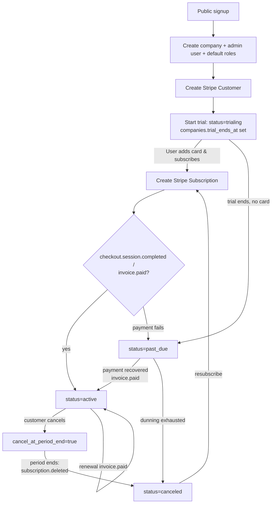

# Multi-Tenant SaaS Conversion Strategy

**Digital Leap GPOMS — Guest Post Operations Management System**

> Status: Planning deliverable for Phase 3
> Stack: FastAPI · SQLAlchemy · PostgreSQL · Next.js
> Audience: Backend, frontend, and platform engineers; technical leadership
> Last updated: 2026-06-05

## Introduction

GPOMS ships in **Phase 1** as a single-company internal tool that runs on `localhost`. **Phase 3** converts it into a multi-tenant SaaS that many independent agencies and businesses ("tenants") can sign up for, pay for, and use in isolation from one another.

The single most important fact driving this strategy is that **the database was designed tenancy-ready from day one**. Every tenant-scoped table already carries a `company_id UUID NOT NULL` foreign key to the `companies` table, and Phase 1 simply seeds one default company that owns all rows. The Phase-3 billing tables (`subscription_plans`, `plan_features`, `company_subscriptions`, `company_invoices`, `payment_methods`, `subscription_events`, `company_settings`) and the supporting enums (`plan_tier`, `subscription_status`) are **already present in `docs/database/schema.sql`**. As a result, the conversion is overwhelmingly an *application-layer and product* exercise — query scoping, authentication, billing, signup, and operations — rather than a schema migration. There is no "shard the data" project here; the data was always shaped for it.

This document defines the multi-tenancy model, the enforcement mechanisms that guarantee data isolation, the Stripe billing integration, plan-based feature gating, the public onboarding flow, an ordered migration checklist, and the security/compliance posture.

## Table of contents

1. [Overview & goals](#1-overview--goals)
2. [Multi-tenancy model](#2-multi-tenancy-model)
3. [Tenant isolation enforcement](#3-tenant-isolation-enforcement)
4. [Subscription & billing](#4-subscription--billing)
5. [Plans & feature gating](#5-plans--feature-gating)
6. [Onboarding / signup flow](#6-onboarding--signup-flow)
7. [Migration checklist (single-tenant → multi-tenant)](#7-migration-checklist-single-tenant--multi-tenant)
8. [Security, compliance & operations](#8-security-compliance--operations)

---

## 1. Overview & goals

### What we are converting

| Dimension | Phase 1 (today) | Phase 3 (target) |
| --- | --- | --- |
| Tenancy | One seeded default company | Unlimited self-served companies |
| Deployment | `localhost`, single instance | Managed cloud, public domain |
| Auth | Single org's users | Per-company users, company resolved from token |
| Access control | App roles only | App roles **plus** strict tenant isolation |
| Monetization | None | Stripe subscriptions, trial → paid lifecycle |
| Account creation | DB seed / admin invite | Public self-service signup |
| Operations | Manual | Per-tenant limits, billing, GDPR export/delete |

### Goals

- **G1 — Strict data isolation.** A user authenticated for company A must never read, write, count, export, or even *infer the existence of* company B's data. Isolation is enforced in depth (application + optional database RLS), not by convention.
- **G2 — Minimal rework.** Because `company_id` already exists on every tenant table, we extend the existing `BaseRepository`/service layer with scoping rather than re-modeling data. No table needs a new tenancy column.
- **G3 — Self-service growth.** A prospect can sign up, land in a working trial, invite teammates, and convert to paid without any manual provisioning.
- **G4 — Billing correctness.** Subscription state in our database is a faithful, idempotent projection of Stripe. We never double-charge, never lose a webhook, and never let billing state and access state drift apart.
- **G5 — Operable at scale.** Per-tenant rate limits, noisy-neighbor controls, backups, and a clean tenant offboarding/export path are first-class.

### Non-goals (Phase 3)

- Database-per-tenant or schema-per-tenant physical isolation (see §2 for the justification).
- Custom per-tenant code or deployments ("single-tenant enterprise edition").
- Usage-metered/consumption billing — Phase 3 is flat-rate plan tiers with hard limits.

---

## 2. Multi-tenancy model

### Chosen approach: shared database, shared schema, row-level isolation by `company_id`

All tenants live in one PostgreSQL database and one schema. Every tenant-scoped table carries `company_id`, and the tenant boundary is a **mandatory predicate on every query** (`WHERE company_id = :current_company`), reinforced optionally by PostgreSQL Row-Level Security (§3).

This is the model the schema already commits us to. Tables such as `projects`, `websites`, `guest_posts`, `payments`, `tasks`, `notifications`, `activity_logs`, and `files` all declare:

```sql
company_id UUID NOT NULL REFERENCES companies(id) ON DELETE CASCADE
```

with composite indexes that **lead** on `company_id`, e.g.:

```sql
CREATE INDEX idx_projects_company  ON projects(company_id);
CREATE INDEX idx_projects_status   ON projects(company_id, status);
CREATE INDEX idx_guest_posts_status ON guest_posts(company_id, status);
```

Leading on `company_id` means tenant-scoped queries stay index-aligned and a tenant's working set is physically clustered for cache efficiency. `ON DELETE CASCADE` to `companies` gives us a clean tenant-deletion primitive (§8).

### Comparison with alternatives

| Model | Isolation | Operational cost | Cross-tenant analytics | Migration effort | Per-tenant scaling | Fit for GPOMS |
| --- | --- | --- | --- | --- | --- | --- |
| **Shared DB, shared schema (chosen)** | Logical (`company_id` + RLS) | Lowest — one DB, one migration pipeline | Trivial (one query) | **Already done** — column exists | Pooled; manage noisy neighbors in app | **Best fit** |
| Schema-per-tenant | Stronger (separate `search_path`) | Medium — N schemas, N× migrations, connection juggling | Hard (UNION across schemas) | High — re-template every model | Per-schema tuning possible | Overkill at our scale |
| Database-per-tenant | Strongest (physical) | Highest — N databases, N backups, provisioning automation, connection sprawl | Very hard (cross-DB) | Very high — re-architect data access | True per-tenant isolation/scaling | Only for regulated enterprise tiers |

### Justification

GPOMS tenants are SEO/marketing agencies and businesses managing guest-post operations: dozens to low-thousands of tenants, each with modest row counts (projects, websites, posts, payments, tasks). This profile is the canonical sweet spot for shared-schema multi-tenancy:

- **The schema already mandates it.** `company_id NOT NULL` everywhere plus `company_id`-leading indexes is precisely the shared-schema design. Choosing anything else would mean discarding existing work.
- **One migration pipeline.** A single Alembic head migrates all tenants atomically. Schema-per-tenant turns every release into N migrations with partial-failure risk.
- **Cheap cross-tenant operations.** Platform analytics, billing reconciliation, and admin tooling are ordinary SQL. The provider's own console ("which tenants are past_due?") is one query.
- **Cost.** One connection pool, one backup target, one observability surface. Database-per-tenant multiplies infrastructure and on-call burden with no benefit at our data volumes.
- **Isolation is solvable in software.** A disciplined repository layer plus optional RLS (§3) closes the only real downside — the risk of a missing `WHERE` clause — without paying the cost of physical separation.

If a future enterprise tier demands physical isolation or a data-residency guarantee, we can promote *specific* tenants to a dedicated database while the long tail stays shared. The `company_id` boundary makes that selective promotion mechanical, not a rewrite.

---

## 3. Tenant isolation enforcement

Isolation is enforced at three layers so that no single mistake (a forgotten filter, a malicious payload, an ORM relationship traversal) can leak data across tenants.

```
Layer 1  Identity      JWT carries company_id  →  get_current_company dependency
Layer 2  Application   TenantRepository / scoped service forces WHERE company_id = :ctx
Layer 3  Database      PostgreSQL RLS policies (defense-in-depth, optional but recommended)
```

### 3.1 Layer 1 — The tenant is resolved from the token, never the client

On login we mint a JWT whose claims include the user's `company_id`. The tenant context is derived **exclusively** from this verified claim. We never read a company identifier from a request body, query string, path parameter, or header for the purpose of choosing *which tenant's data to access*.

```python
# app/core/security.py  — token minting (excerpt)
def create_access_token(*, user_id: str, company_id: str, roles: list[str]) -> str:
    payload = {
        "sub": user_id,
        "company_id": company_id,   # the tenant boundary, signed
        "roles": roles,
        "exp": _expiry(),
    }
    return jwt.encode(payload, settings.JWT_SECRET, algorithm="HS256")
```

```python
# app/core/deps.py
from uuid import UUID
from fastapi import Depends, HTTPException, status

class TenantContext:
    def __init__(self, company_id: UUID, user_id: UUID, roles: list[str]):
        self.company_id = company_id
        self.user_id = user_id
        self.roles = roles

def get_current_company(claims: dict = Depends(decode_access_token)) -> TenantContext:
    company_id = claims.get("company_id")
    if not company_id:
        raise HTTPException(status.HTTP_401_UNAUTHORIZED, "No tenant in token")
    return TenantContext(
        company_id=UUID(company_id),
        user_id=UUID(claims["sub"]),
        roles=claims.get("roles", []),
    )
```

Every protected route depends on `get_current_company`, so the tenant boundary is available to the service/repository layer on every request and cannot be omitted by accident.

### 3.2 Layer 2 — A base repository that always filters by `company_id`

The existing `BaseRepository[ModelT]` (`app/repositories/base.py`) already centralizes CRUD. We introduce a `TenantRepository[ModelT]` subclass that **injects the tenant predicate into every read and stamps it onto every write**, so concrete repositories cannot forget it.

```python
# app/repositories/tenant.py
from collections.abc import Sequence
from typing import Any
from sqlalchemy import func, select
from app.repositories.base import BaseRepository, ModelT
from app.core.deps import TenantContext

class TenantRepository(BaseRepository[ModelT]):
    """BaseRepository that is hard-bound to a single tenant.

    Every query is filtered by company_id and every insert is stamped with it.
    Concrete repos (ProjectRepository, GuestPostRepository, ...) subclass this.
    """

    def __init__(self, db, ctx: TenantContext) -> None:
        super().__init__(db)
        self.company_id = ctx.company_id

    def _scoped(self, stmt):
        return stmt.where(self.model.company_id == self.company_id)

    def get(self, id_: Any) -> ModelT | None:
        stmt = self._scoped(select(self.model).where(self.model.id == id_))
        return self.db.scalars(stmt).first()        # NOT db.get() — that bypasses the filter

    def list(self, *, offset: int = 0, limit: int = 20) -> Sequence[ModelT]:
        stmt = self._scoped(select(self.model)).offset(offset).limit(limit)
        return self.db.scalars(stmt).all()

    def count(self) -> int:
        stmt = self._scoped(select(func.count()).select_from(self.model))
        return self.db.scalar(stmt) or 0

    def add(self, obj: ModelT) -> ModelT:
        obj.company_id = self.company_id            # force ownership; ignore any client value
        return super().add(obj)
```

Rules that make this airtight:

- **`get()` is overridden** so it never falls back to `Session.get()`, which would fetch by primary key *across* tenants.
- **`add()` overwrites `company_id`** from the context, so even if a request payload contains a `company_id`, it is discarded.
- **No raw `select(Model)` in services.** Services receive a tenant-bound repository; ad-hoc queries are code-review-blocked and lint-flagged.
- **Relationship loads are also scoped.** When traversing relationships that could cross tenants, we re-filter; in practice every child row carries its own `company_id`, so the scoped repo covers them too.

### 3.3 Layer 3 — PostgreSQL Row-Level Security (defense-in-depth)

RLS is the backstop: even a buggy query or a future raw-SQL report physically cannot return another tenant's rows, because the database itself enforces the boundary. We set a per-transaction GUC (`app.current_company`) from the tenant context and let policies do the rest.

```sql
-- Enable RLS and define a policy (run once per tenant-scoped table).
ALTER TABLE projects ENABLE ROW LEVEL SECURITY;
ALTER TABLE projects FORCE ROW LEVEL SECURITY;   -- applies even to the table owner

CREATE POLICY tenant_isolation ON projects
    USING      (company_id = current_setting('app.current_company')::uuid)
    WITH CHECK (company_id = current_setting('app.current_company')::uuid);
```

```python
# Set the GUC at the start of each request's DB session (LOCAL = transaction-scoped).
from sqlalchemy import text

def bind_tenant(db, ctx: TenantContext) -> None:
    db.execute(
        text("SELECT set_config('app.current_company', :cid, true)"),
        {"cid": str(ctx.company_id)},
    )
```

- `USING` filters rows on read/update/delete; `WITH CHECK` rejects inserts/updates that would place a row in another tenant. Together they make cross-tenant access impossible at the storage layer.
- `FORCE ROW LEVEL SECURITY` ensures even the application's table-owner role is constrained.
- The application connects with a **non-superuser, non-`BYPASSRLS`** role, because superusers bypass RLS.
- Platform/admin tooling that legitimately needs cross-tenant reads uses a separate, explicitly audited role.

> RLS is marked optional in the schema, but we **recommend enabling it** before public launch. It is a one-time DDL pass and converts "a forgotten `WHERE` clause leaks data" from a sev-1 incident into a query that simply returns zero rows.

### 3.4 Guardrails

- **Never trust client-supplied `company_id`.** It is stripped on write and ignored on read; the only source of truth is the JWT claim. Inputs are validated but the tenant is *not* taken from them.
- **Cross-tenant access test suite.** An automated test seeds two companies, authenticates as company A, and asserts that every endpoint returns `404`/empty for company B's resource IDs — for `GET`, `PUT`, `PATCH`, `DELETE`, list, count, and export. This suite runs in CI and gates merges.
- **404, not 403, on foreign IDs.** Returning "not found" (rather than "forbidden") avoids leaking that a resource exists in another tenant.
- **IDOR fuzzing.** A periodic job replays valid resource IDs from tenant A against tenant B's token to catch any newly added unscoped endpoint.
- **Audit trail.** Every mutation is recorded in `activity_logs(company_id, …)` (§8), giving a per-tenant forensic record.

---

## 4. Subscription & billing

Billing is a faithful, idempotent projection of **Stripe** into our pre-existing billing tables. Stripe is the system of record for money; our database is the system of record for *access*. A webhook pipeline keeps them consistent.

### 4.1 Object mapping (Stripe → GPOMS tables)

| Stripe object | GPOMS table / column | Notes |
| --- | --- | --- |
| Customer | `company_subscriptions.stripe_customer_id` | One Stripe customer per company |
| Subscription | `company_subscriptions.stripe_subscription_id`, `status`, `current_period_start/end`, `cancel_at_period_end` | `status` maps to our `subscription_status` enum |
| Price | `subscription_plans.stripe_price_id` | Links a plan tier to a Stripe Price |
| Invoice | `company_invoices.stripe_invoice_id`, `amount_usd`, `status`, `issued_at`, `paid_at`, `hosted_invoice_url` | `status`: `draft\|open\|paid\|void\|uncollectible` |
| PaymentMethod | `payment_methods.stripe_payment_method_id`, `brand`, `last4`, `exp_month`, `exp_year`, `is_default` | Card metadata only; PAN never touches our servers |
| Event (webhook) | `subscription_events.stripe_event_id` (UNIQUE), `event_type`, `payload`, `processed_at` | Idempotency + full audit of every webhook |
| `trialing` / trial end | `companies.trial_ends_at`, `company_subscriptions.status = 'trialing'` | Trial managed by Stripe and mirrored locally |

The `subscription_status` enum is the canonical access-control state:

```sql
CREATE TYPE subscription_status AS ENUM
    ('trialing', 'active', 'past_due', 'canceled', 'incomplete');
```

### 4.2 Subscription lifecycle

| Status | Meaning | App access |
| --- | --- | --- |
| `incomplete` | Subscription created, first payment not yet confirmed | Limited / blocked until confirmed |
| `trialing` | In free trial (`companies.trial_ends_at` in the future) | Full plan access |
| `active` | Paid and current | Full plan access |
| `past_due` | A renewal payment failed; in dunning/grace | Read-mostly grace window, then restrict writes |
| `canceled` | Subscription ended (voluntary or after dunning) | Login + export only; tenant data retained per retention policy |

Transitions are driven by Stripe events, never set speculatively by the app.

### 4.3 Lifecycle flowchart



### 4.4 Idempotent webhook handling

Stripe delivers events at-least-once and out of order. The pipeline is built around the `subscription_events.stripe_event_id UNIQUE` constraint so that replays and duplicates are no-ops.

```python
# app/routes/billing.py  (excerpt)
@router.post("/webhooks/stripe")
async def stripe_webhook(request: Request, db: Session = Depends(get_db)):
    payload = await request.body()
    sig = request.headers.get("stripe-signature")
    event = stripe.Webhook.construct_event(payload, sig, settings.STRIPE_WEBHOOK_SECRET)

    # 1. Idempotency gate: UNIQUE(stripe_event_id) rejects duplicates atomically.
    inserted = db.execute(
        insert(SubscriptionEvent)
        .values(stripe_event_id=event["id"], event_type=event["type"], payload=event)
        .on_conflict_do_nothing(index_elements=["stripe_event_id"])
        .returning(SubscriptionEvent.id)
    ).first()
    if inserted is None:
        return {"status": "duplicate_ignored"}      # already processed

    # 2. Apply the state change (map customer/subscription to company_subscriptions).
    handle_stripe_event(db, event)

    # 3. Mark processed for observability and replay tooling.
    db.execute(
        update(SubscriptionEvent)
        .where(SubscriptionEvent.stripe_event_id == event["id"])
        .values(processed_at=func.now())
    )
    db.commit()
    return {"status": "ok"}
```

Principles:

- **Verify the signature** with `STRIPE_WEBHOOK_SECRET` before trusting any payload.
- **Record-then-process.** The unique insert is the idempotency key; if it conflicts, we return early without re-applying state.
- **Resolve the tenant from Stripe IDs**, not from the request — map `stripe_customer_id` → `company_subscriptions.company_id`.
- **Return 2xx fast**; do heavier work asynchronously if needed so Stripe does not retry on slow handlers.
- **Reconciliation job.** A daily task pulls subscription state from Stripe and repairs any drift (e.g., a webhook lost during an outage), using `subscription_events` as the processed-ledger.

Key events handled: `checkout.session.completed`, `customer.subscription.created/updated/deleted`, `invoice.paid`, `invoice.payment_failed`, `customer.subscription.trial_will_end`.

---

## 5. Plans & feature gating

Three flat-rate tiers, defined by the `plan_tier` enum (`starter`, `professional`, `agency`) and stored in `subscription_plans` with per-plan flags in `plan_features`.

### 5.1 Plan comparison (illustrative)

| | **Starter** | **Professional** | **Agency** |
| --- | --- | --- | --- |
| `price_monthly_usd` | $29 | $99 | $299 |
| `price_yearly_usd` | $290 | $990 | $2,990 |
| `max_users` | 3 | 15 | NULL (unlimited) |
| `max_projects` | 5 | 50 | NULL (unlimited) |
| Guest post pipeline | ✓ | ✓ | ✓ |
| Outreach + payments tracking | ✓ | ✓ | ✓ |
| Custom roles / RBAC | — | ✓ | ✓ |
| Saved reports & CSV export | Basic | ✓ | ✓ |
| Custom branding (`company_settings.brand_color`, logo) | — | ✓ | ✓ |
| API access | — | — | ✓ |
| Priority support / SLA | — | Email | Priority |

> `NULL` in `max_users` / `max_projects` means **unlimited**, per the schema comment (`max_users INTEGER, -- NULL = unlimited`).

### 5.2 How gating works

There are two kinds of gates, both backed by existing tables:

**(a) Boolean feature flags — `plan_features`.** Each plan has rows like `(feature_key='custom_branding', value=true)` or `(feature_key='api_access', value=false)`. The `value` is `JSONB`, so a flag can also carry configuration (e.g., `{"max_seats_per_project": 10}`). Flags are loaded once per request (and cached) from the company's active subscription plan.

```python
# app/services/entitlements.py
class Entitlements:
    def __init__(self, plan_id, features: dict, max_users, max_projects):
        self.features = features          # {feature_key: value} from plan_features
        self.max_users = max_users        # None => unlimited
        self.max_projects = max_projects

    def requires(self, feature_key: str) -> None:
        if not self.features.get(feature_key):
            raise HTTPException(403, f"Your plan does not include '{feature_key}'. Upgrade to continue.")

def require_feature(feature_key: str):
    def _dep(ent: Entitlements = Depends(get_entitlements)):
        ent.requires(feature_key)
    return Depends(_dep)
```

```python
@router.post("/api-keys", dependencies=[require_feature("api_access")])
def create_api_key(...):
    ...
```

**(b) Usage limits — `subscription_plans.max_users` / `max_projects`.** Enforced at the create path by comparing a live count (from the tenant-scoped repository) against the plan limit. `NULL` short-circuits as unlimited.

```python
# Block project creation past the plan limit.
def create_project(ctx: TenantContext, repo: ProjectRepository, ent: Entitlements, data):
    if ent.max_projects is not None and repo.count() >= ent.max_projects:
        raise HTTPException(
            status.HTTP_402_PAYMENT_REQUIRED,
            f"Project limit reached ({ent.max_projects}). Upgrade your plan to add more.",
        )
    return repo.add(Project(**data.model_dump()))
```

Notes:

- **Count is tenant-scoped automatically** because `repo.count()` uses the `TenantRepository` filter — limits are inherently per-company.
- **Enforce on the write path, surface on read.** The UI shows "4 / 5 projects used" by reading the same count + limit, so users hit upgrade prompts before the hard `402`.
- **Downgrade safety.** If a tenant downgrades below current usage, we do not delete data; we block *new* creation until they are back under the limit, and flag over-limit resources in the admin UI.
- **Single source of truth.** Limits and flags come only from the company's active plan via `company_subscriptions.plan_id` → `subscription_plans` / `plan_features`. There are no limits hard-coded in application code.

---

## 6. Onboarding / signup flow

Public, self-service signup must produce a fully working tenant in one transaction — no manual provisioning, no broken half-states.

### 6.1 What a signup creates (atomically)

A `POST /auth/signup` handler runs the following inside a single database transaction; if any step fails, the whole tenant creation rolls back:

1. **Company** — insert into `companies` with a unique `slug`, `plan_tier='starter'` (default), `is_active=true`, and `trial_ends_at = now() + 14 days`.
2. **First admin user** — insert into `users` with `company_id`, the email (unique per `UNIQUE(company_id, email)`), and a hashed password; mark as the company owner/admin.
3. **Default roles** — create the company's default roles (`owner`/`admin`, `manager`, `member`) in `roles` (`company_id`-scoped; the schema allows `company_id = NULL` for global system roles and non-null for per-company roles), and grant the new user the admin role via `user_roles`.
4. **Company settings** — insert a `company_settings` row (default currency, timezone, date format) so per-tenant config exists from minute one.
5. **Trial subscription** — create a Stripe Customer, insert `company_subscriptions` with `status='trialing'` and `plan_id` = Starter, and record a `subscription_events` row for the trial start. No card is required to start the trial.
6. **Welcome + session** — issue the JWT (carrying the new `company_id`), send a verification/welcome email, and land the user in the app.

```python
# app/services/signup.py  (sketch)
def signup(db, payload: SignupRequest) -> AuthTokens:
    with db.begin():                                  # all-or-nothing
        company = create_company(db, name=payload.company_name,
                                 slug=unique_slug(db, payload.company_name),
                                 trial_ends_at=utcnow() + timedelta(days=14))
        user = create_admin_user(db, company.id, payload.email, payload.password)
        seed_default_roles(db, company.id, owner_user_id=user.id)
        create_company_settings(db, company.id, timezone=payload.timezone)
        start_trial_subscription(db, company.id)      # Stripe customer + company_subscriptions
    send_welcome_email(user)
    return issue_tokens(user, company)
```

### 6.2 Tenant slug / subdomain

- **`companies.slug` is globally unique** (`slug VARCHAR(180) NOT NULL UNIQUE`) and is the tenant's stable public handle.
- **Phase 3 launch: path/header-based tenancy.** The tenant is resolved from the JWT (§3), so we do *not* depend on subdomains for isolation. The slug is used for shareable URLs and as a vanity identifier.
- **Optional subdomain routing (`{slug}.gpoms.app`).** Cleaner branding and per-tenant cookie scoping. If adopted, the subdomain is treated as a *hint* only — the authoritative tenant is still the signed `company_id` claim, and we assert the host's slug matches the token's company to prevent confused-deputy issues.
- **Slug hygiene** — generated from the company name, lowercased, deduplicated with a numeric suffix on collision, and screened against a reserved list (`www`, `api`, `app`, `admin`, `billing`, `static`).

### 6.3 Inviting teammates

After signup, the admin invites users via the existing `user_invitations(company_id, …)` table. Invitations are company-scoped; an accepted invite creates a `users` row already bound to the inviting company, and seat creation is gated by `max_users` (§5).

---

## 7. Migration checklist (single-tenant → multi-tenant)

Ordered so each step is independently shippable and the app stays green throughout. Because `company_id` already exists, the early steps are *enforcement*, not schema change.

1. **Backfill / confirm the default company.** Verify the Phase-1 seed company exists and that **every** tenant-scoped row references it. Run a verification query per table: `SELECT count(*) FROM <t> WHERE company_id IS NULL` must be `0`.
2. **Enforce `company_id NOT NULL` everywhere.** The schema already declares `NOT NULL` on tenant tables; assert it in the live DB and add a CI check (and an Alembic migration if any environment drifted) so no tenant table can be created without it.
3. **Add company resolution to auth.** Put `company_id` into JWT claims; implement `get_current_company` / `TenantContext`; require it on every protected route. (§3.1)
4. **Add company scoping to all repositories/services.** Introduce `TenantRepository`; migrate every concrete repository (`ProjectRepository`, `WebsiteRepository`, `GuestPostRepository`, `PaymentRepository`, `TaskRepository`, …) to subclass it; remove all unscoped `select(Model)` from services. Land the **cross-tenant access test suite** in CI alongside this. (§3.2, §3.4)
5. **Add the public signup flow.** Implement atomic company + admin user + default roles + `company_settings` + trial subscription creation; slug generation; welcome email. (§6)
6. **Wire Stripe.** Seed `subscription_plans` + `plan_features` for Starter/Pro/Agency with real `stripe_price_id`s; build Checkout, the billing portal, and the idempotent webhook pipeline writing to `company_subscriptions`, `company_invoices`, `payment_methods`, `subscription_events`. (§4)
7. **Add feature gating.** Implement the `Entitlements` service and `require_feature` dependency; enforce `max_users` / `max_projects` on create paths; surface usage in the UI. (§5)
8. **Add RLS (recommended).** Enable + `FORCE ROW LEVEL SECURITY` and a `tenant_isolation` policy on every tenant table; switch the app to a non-`BYPASSRLS` role; set `app.current_company` per transaction. Validate with the cross-tenant test suite passing *with RLS on*. (§3.3)
9. **Add admin / company-management UI.** Tenant list and detail (plan, status, usage, `trial_ends_at`), suspend/reactivate (`companies.is_active`), per-company subscription view, and a provider console for `past_due`/`canceled` tenants.
10. **Operational hardening.** Per-tenant rate limits, GDPR export/delete endpoints, backup verification, noisy-neighbor monitoring, and audit-log dashboards. (§8)
11. **Cutover.** Deploy to the public domain; keep the Phase-1 default company as tenant #1; enable signup behind a flag; soft-launch, monitor, then open publicly.

---

## 8. Security, compliance & operations

### Per-tenant rate limiting

Rate limits are keyed on `company_id` (not just IP or user) so one tenant cannot exhaust shared capacity. Limits scale with plan tier (Agency > Professional > Starter). The webhook endpoint and auth endpoints have separate, stricter buckets. A breached limit returns `429` with `Retry-After`.

### Data export & deletion (GDPR / CCPA)

- **Export.** A per-tenant export endpoint produces a machine-readable archive (JSON/CSV per table) of *only* that company's rows, assembled through the tenant-scoped repositories so it physically cannot include another tenant's data. Results are tracked in `report_exports(company_id, …)`.
- **Deletion (right to erasure).** Because every tenant table has `ON DELETE CASCADE` to `companies`, deleting the `companies` row removes all dependent data in one operation. Deletion is a two-step, audited workflow: soft-disable (`companies.is_active = false`) with a retention window, then hard delete. Stripe customer/subscription is canceled and the customer object is deleted in parallel.
- **Retention policy.** `canceled` tenants retain data for a defined grace period (e.g., 30 days) for win-back/export before scheduled erasure.

### Backups & recovery

- Single shared database means **one backup pipeline**: automated daily snapshots plus point-in-time recovery (WAL archiving).
- **Restore drills** are run on a schedule. Because tenancy is logical, a single-tenant restore is performed by restoring to a staging instance and exporting that company's rows back, rather than restoring the whole production DB.
- Backups are encrypted at rest; access is least-privilege and audited.

### Noisy-neighbor considerations

- **Connection pooling** (e.g., PgBouncer) prevents any one tenant from monopolizing connections; statement timeouts cap runaway queries.
- **`company_id`-leading indexes** (already in the schema) keep each tenant's queries on their own index range, limiting cross-tenant cache pollution.
- **Heavy/async work** (report generation, bulk exports, webhook fan-out) runs on background workers with **per-tenant concurrency caps** so a large Agency tenant cannot starve smaller ones.
- **Observability is tenant-tagged**: latency, error rate, and query cost are sliced by `company_id` to spot a noisy neighbor before it impacts others.

### Audit logging (already provided)

The schema ships `activity_logs(company_id, …)` with the index `idx_activity_company_time ON activity_logs(company_id, created_at DESC)`. Every state-changing action (logins, role grants, project/post/payment mutations, plan changes) is recorded here, giving each tenant an immutable, queryable audit trail for security investigations and compliance evidence. Billing actions additionally have the `subscription_events` ledger (§4). No new tables are required to satisfy audit requirements.

### Secrets & platform hardening

- Stripe keys, JWT secret, and the DB DSN live in environment/secret storage, never in source.
- The application database role is **non-superuser and non-`BYPASSRLS`** so RLS is always in force.
- Webhook signatures are verified; admin/cross-tenant tooling uses a separate, explicitly audited role and is logged to `activity_logs`.
