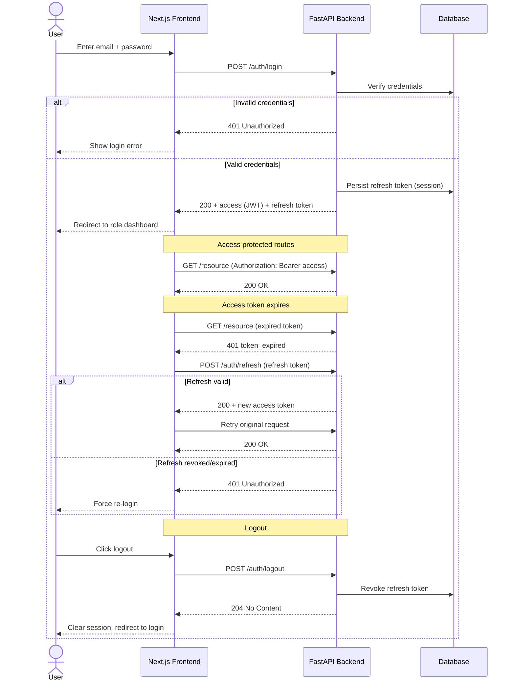
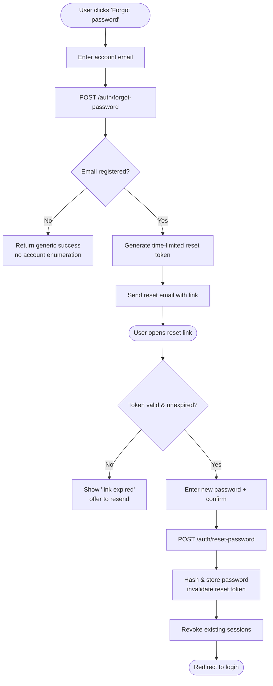
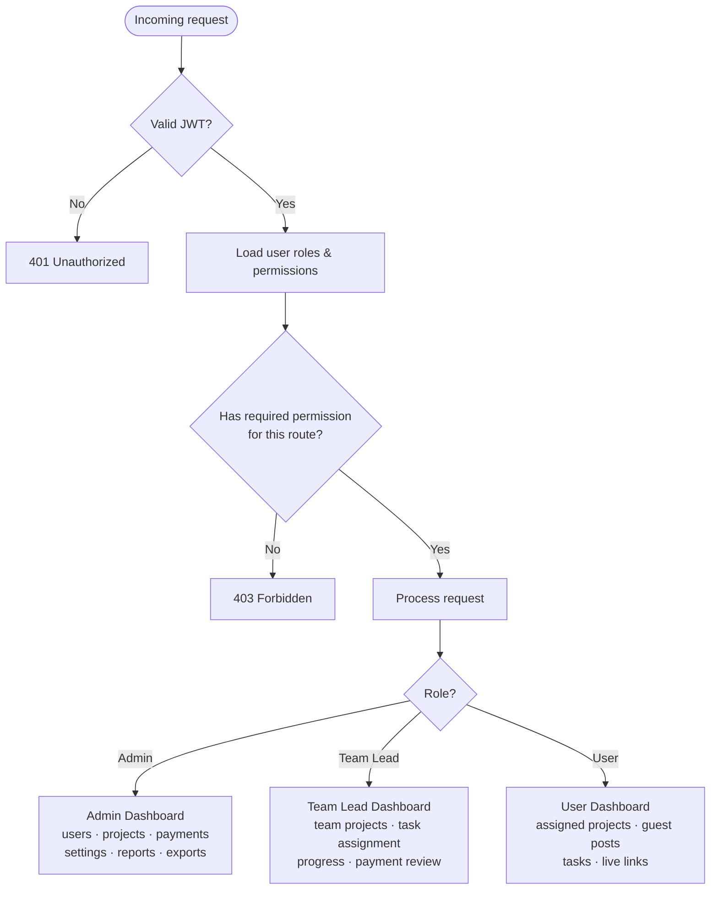
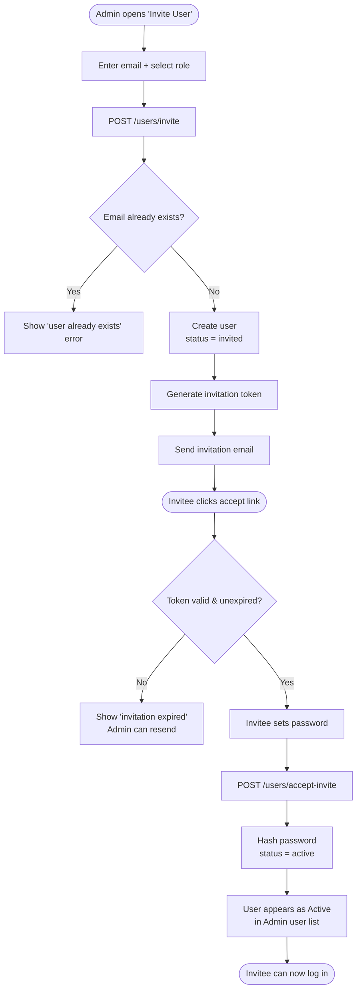
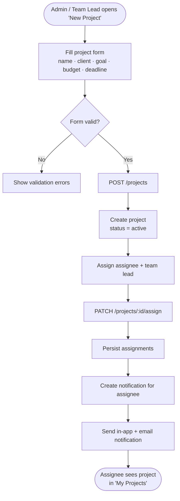
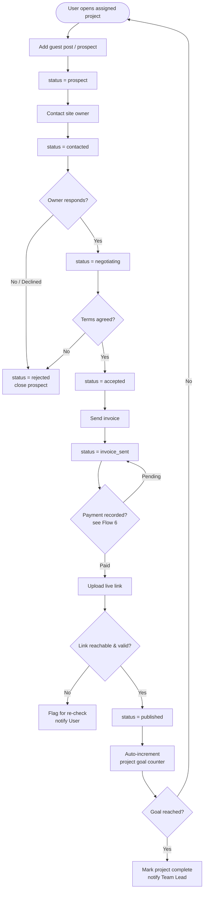
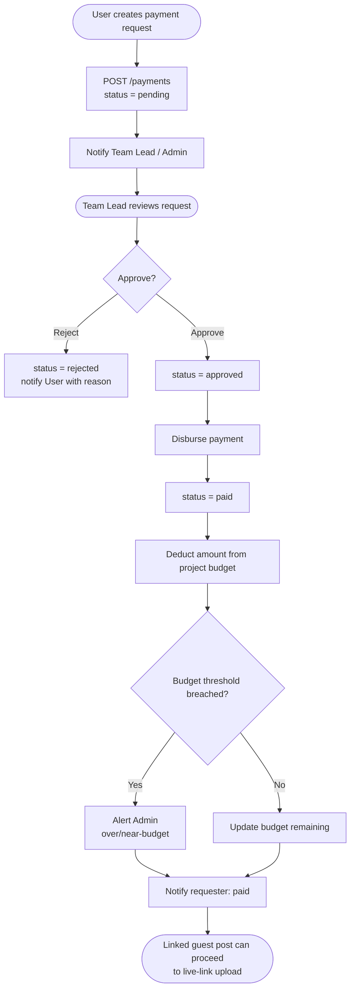
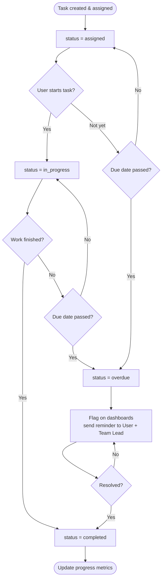
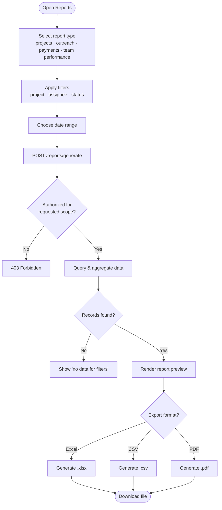

# Digital Leap GPOMS — User Flows

This document describes the key user flows for **Digital Leap GPOMS** (Guest Post Operations Management System), a role-based application built on a **FastAPI** backend and a **Next.js** frontend. It is intended as a planning deliverable: each flow captures the happy path plus the most important alternate/error branches, and is illustrated with a [Mermaid](https://mermaid.js.org/) diagram so engineers, QA, and stakeholders share one canonical mental model.

GPOMS coordinates the end-to-end guest-posting pipeline — from prospect discovery and outreach through negotiation, payment, and live-link verification — across three roles. The flows below show how each role interacts with the system, how authentication and authorization gate every request, and how state transitions (outreach statuses, task statuses, payment statuses) propagate side effects such as notifications, budget updates, and project-goal increments.

## Roles & Permissions Summary

| Permission / Capability        | Admin | Team Lead | User |
| ------------------------------ | :---: | :-------: | :--: |
| Manage users (invite/disable)  |   ✅  |     ❌    |  ❌  |
| Assign team leads              |   ✅  |     ❌    |  ❌  |
| Configure system settings      |   ✅  |     ❌    |  ❌  |
| Create projects                |   ✅  |     ✅    |  ❌  |
| Assign projects / tasks        |   ✅  |     ✅    |  ❌  |
| Review team progress           |   ✅  |     ✅    |  ❌  |
| View assigned projects         |   ✅  |     ✅    |  ✅  |
| Add guest posts (prospects)    |   ✅  |     ✅    |  ✅  |
| Update outreach status         |   ✅  |     ✅    |  ✅  |
| Upload live links / publish    |   ✅  |     ✅    |  ✅  |
| Create payment requests        |   ✅  |     ✅    |  ✅  |
| Approve payments               |   ✅  |     ✅    |  ❌  |
| Manage budgets / payments      |   ✅  |  Review   |  ❌  |
| View reports                   |   ✅  |  Scoped   |  ❌  |
| Export data (Excel/CSV/PDF)    |   ✅  |  Scoped   |  ❌  |

Legend: ✅ full access · ❌ no access · **Review** = read + approve within assigned scope · **Scoped** = limited to own teams/projects.

## Table of Contents

1. [Authentication Flow](#1-authentication-flow)
2. [Role-Based Authorization](#2-role-based-authorization)
3. [Admin — Onboard a New Team Member](#3-admin--onboard-a-new-team-member)
4. [Admin / Team Lead — Create & Assign a Project](#4-admin--team-lead--create--assign-a-project)
5. [User — Full Guest-Post Lifecycle](#5-user--full-guest-post-lifecycle)
6. [Team Lead — Payment Approval](#6-team-lead--payment-approval)
7. [Daily Task Lifecycle](#7-daily-task-lifecycle)
8. [Reporting & Export](#8-reporting--export)

---

## 1. Authentication Flow

Users authenticate with email and password. On success the API issues a short-lived **JWT access token** and a longer-lived **refresh token**. The access token authorizes protected requests; when it expires, the frontend performs a **silent refresh** using the refresh token. Logout revokes the refresh token server-side. A separate **forgot-password** branch lets users reset credentials via a time-limited email link.

### Forgot Password → Reset

---

## 2. Role-Based Authorization

Every protected request passes through an authorization dependency. The backend verifies the JWT signature and expiry, loads the user's roles and permissions, and either allows the request or returns **403 Forbidden**. After login, each role lands on a different default dashboard with a scoped permission set.

---

## 3. Admin — Onboard a New Team Member

An Admin invites a new member by entering their email and selecting a role. The system creates a pending user record and emails an invitation containing a time-limited acceptance link. The invitee sets a password, after which the account becomes **active** and appears in the user list.

---

## 4. Admin / Team Lead — Create & Assign a Project

Admins and Team Leads create projects, then assign an **assignee** (the executing User) and a responsible **Team Lead**. On assignment the system notifies the assignee so work can begin immediately.

---

## 5. User — Full Guest-Post Lifecycle

A User opens an assigned project and adds guest-post prospects. Each prospect advances through outreach statuses — **contacted → negotiating → accepted** — then to **invoice_sent**. After payment is recorded, the User uploads the **live link** and marks the post **published**, which auto-increments the project's goal-completion counter.

---

## 6. Team Lead — Payment Approval

A User creates a payment request, which starts as **pending**. A Team Lead or Admin reviews it; on approval it moves to **approved**, and once disbursed it is marked **paid**. Marking paid updates the project budget and triggers notifications to the requester and finance stakeholders.

---

## 7. Daily Task Lifecycle

Tasks are assigned to Users (typically by a Team Lead). A task moves from **assigned → in_progress → completed**. If the due date passes before completion, the task enters an **overdue** state that surfaces on dashboards and triggers reminders until it is resolved.

---

## 8. Reporting & Export

Admins (and Team Leads within their scope) generate reports by selecting a report type, applying filters, and choosing a date range. The system compiles the data set and exports it in the requested format — **Excel, CSV, or PDF**.

