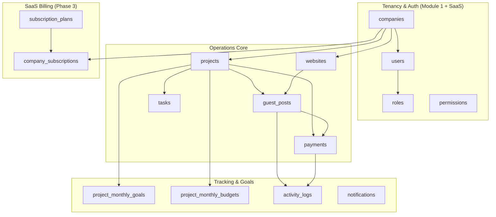
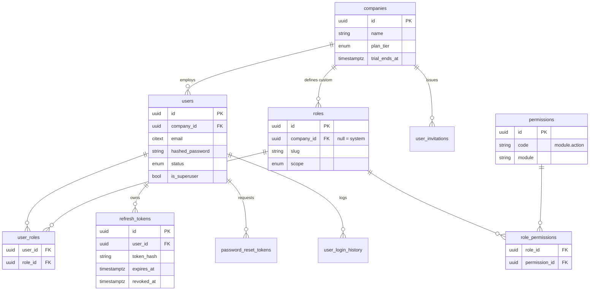
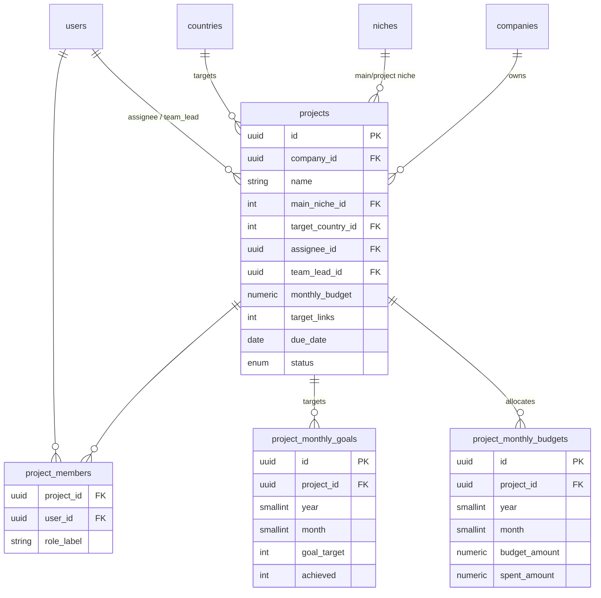
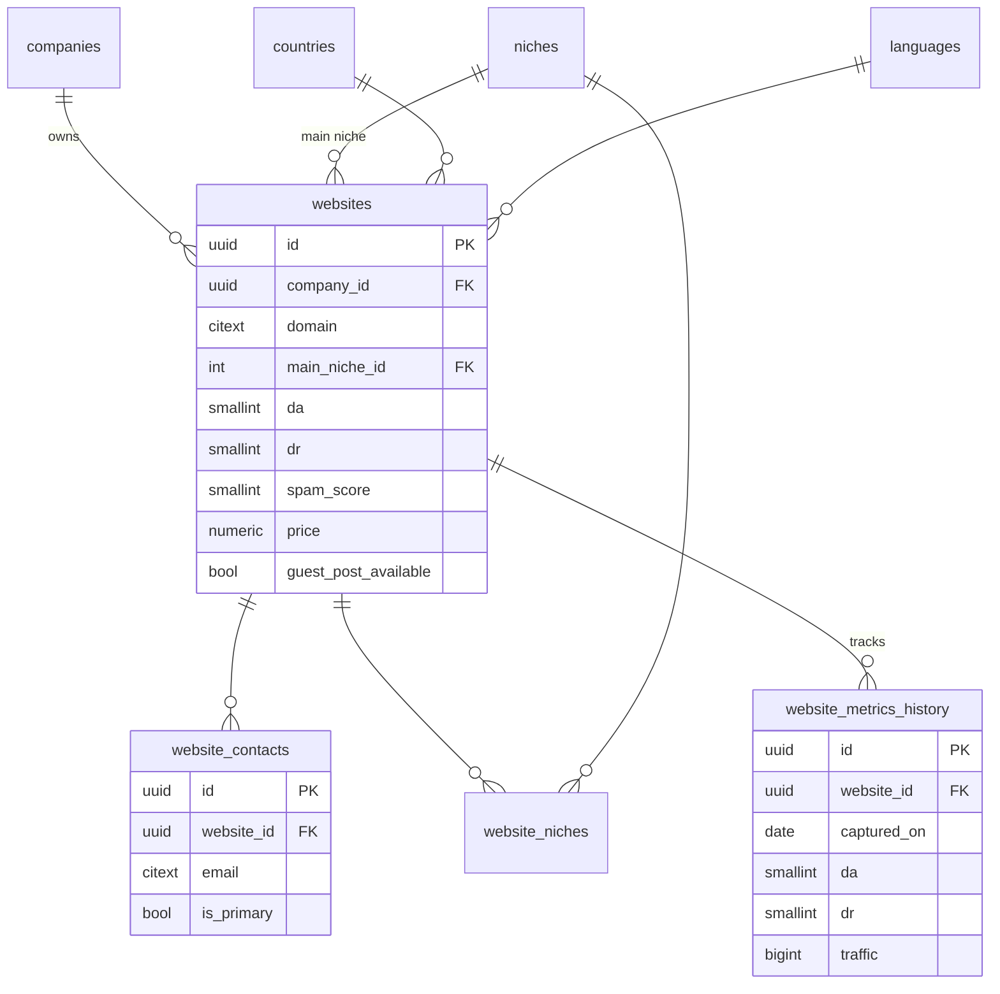
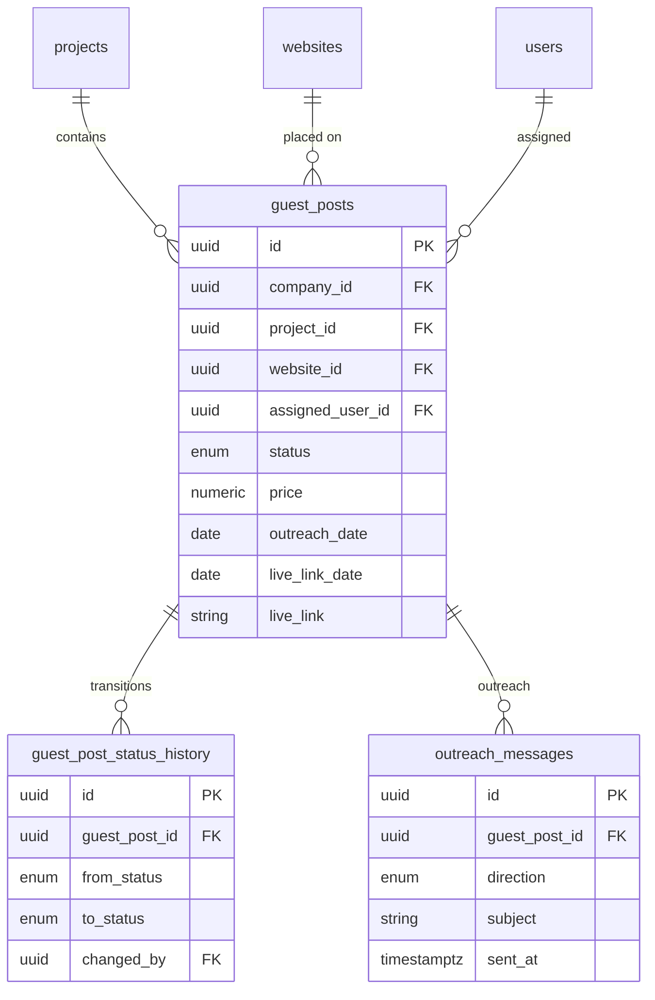
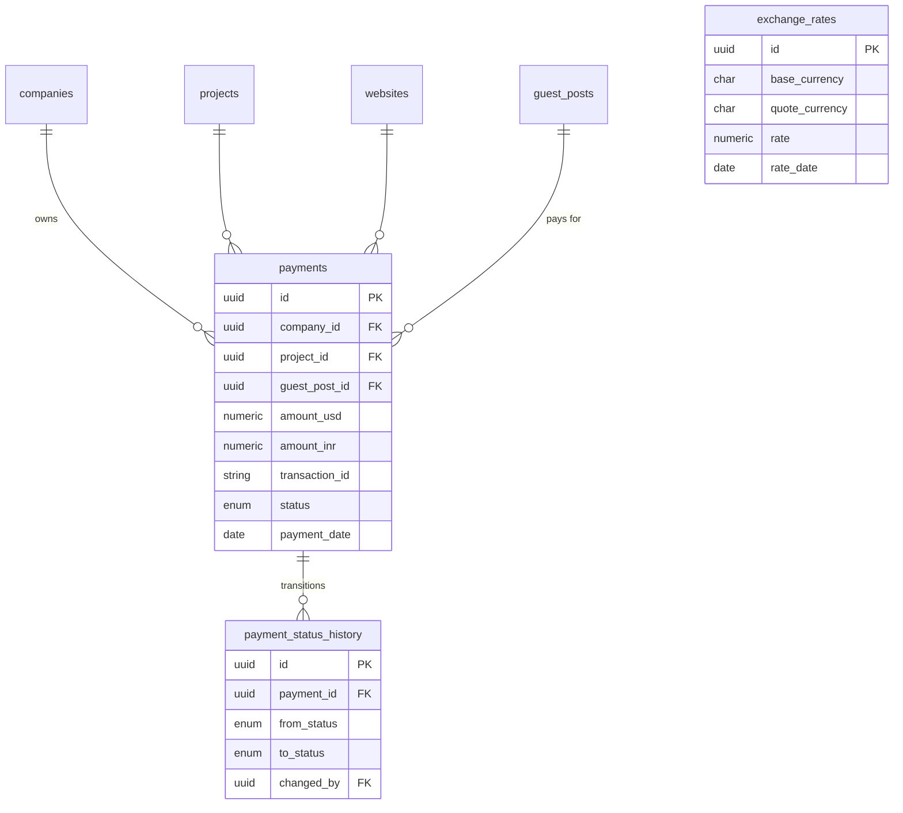
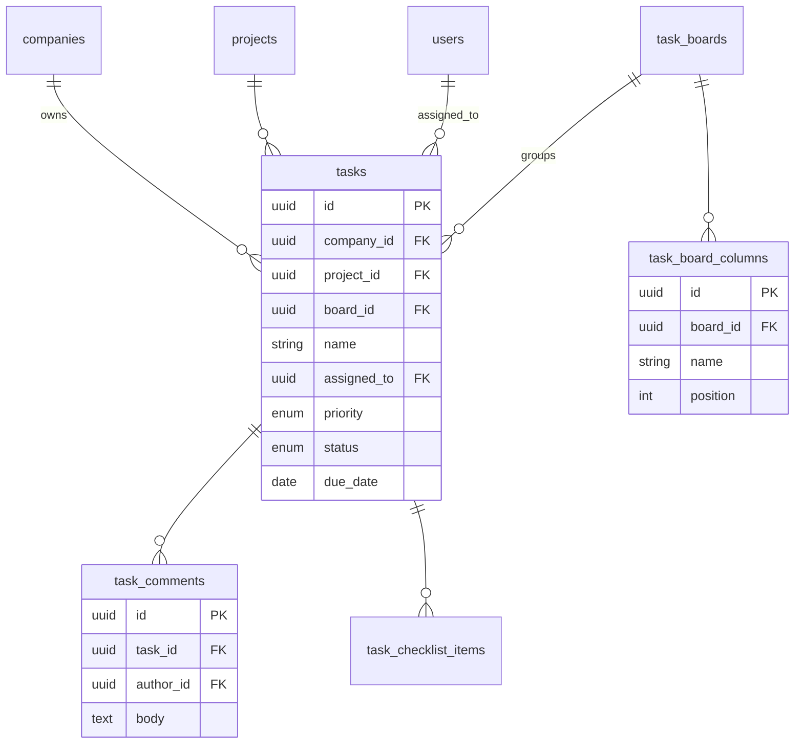
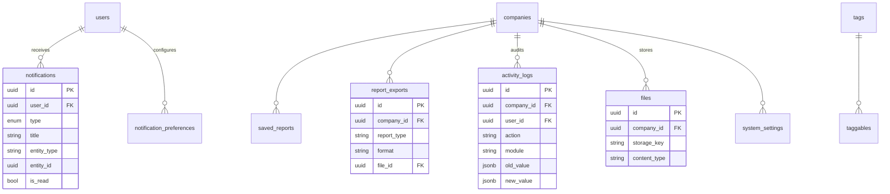
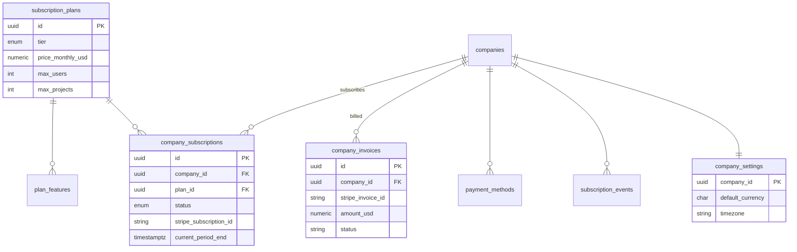

# Entity-Relationship Diagram

Visual model for the GPOMS database. The authoritative DDL is
[schema.sql](schema.sql); column-level notes are in
[data-dictionary.md](data-dictionary.md).

Because a 50-table diagram is unreadable as one graph, the model is presented as a
**domain map** followed by **per-domain ER diagrams**. Every tenant-scoped table
carries `company_id → companies.id` (omitted from some diagrams for clarity).

---

## Domain map

---

## 1. Tenancy & Authentication

---

## 2. Projects, Goals & Budgets

---

## 3. Website Database

---

## 4. Guest Post Tracker

---

## 5. Payments

---

## 6. Tasks (+ Phase 2 Kanban)

---

## 7. Notifications, Reports, Activity & System

---

## 8. SaaS Billing (Phase 3)

