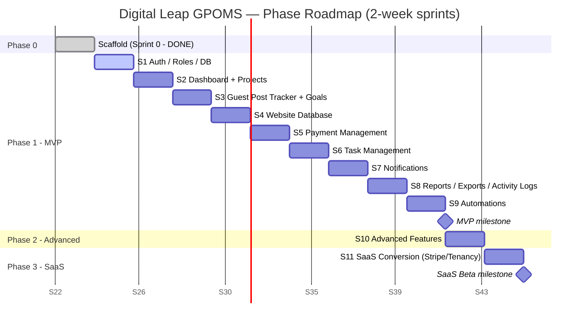

# Digital Leap GPOMS — Development Roadmap & Sprint Plan

> **Project:** Digital Leap GPOMS (Guest Post Operations Management System)
> **Stack:** FastAPI (clean architecture: routes → services → repositories → models) · Next.js + Tailwind + ShadCN · PostgreSQL · Alembic · Docker Compose
> **Cadence:** 2-week sprints · Team: 2–3 engineers (1–2 backend, 1 frontend, shared QA)
> **Status:** Sprint 0 (scaffold) complete. This document plans Sprints 1–11 and the SaaS conversion.

GPOMS replaces the spreadsheet-based guest-posting workflow with a real application, built **module by module** in a strict, dependency-aware order. We ship a usable MVP first (Phase 1), layer on advanced productivity features (Phase 2), then convert the single-tenant app into a multi-tenant SaaS (Phase 3). We deliberately **do not build all modules at once** — each sprint lands one coherent slice with migrations, tests, and a responsive UI.

---

## Table of Contents

1. [Roadmap Overview](#1-roadmap-overview)
2. [Sprint Breakdown](#2-sprint-breakdown)
   - [Sprint 0 — Scaffold (DONE)](#sprint-0--scaffold-done)
   - [Sprint 1 — Foundations: Auth, Roles, DB](#sprint-1--foundations-auth-roles--db-step-1)
   - [Sprint 2 — Dashboard + Project Management](#sprint-2--dashboard--project-management-step-2)
   - [Sprint 3 — Guest Post Tracker + Goal Tracking](#sprint-3--guest-post-tracker--goal-tracking-step-3)
   - [Sprint 4 — Website Database](#sprint-4--website-database-step-4)
   - [Sprint 5 — Payment Management](#sprint-5--payment-management-step-5)
   - [Sprint 6 — Task Management](#sprint-6--task-management-step-6)
   - [Sprint 7 — Notifications](#sprint-7--notifications-step-7)
   - [Sprint 8 — Reports, Exports & Activity Logs](#sprint-8--reports-exports--activity-logs-step-8)
   - [Sprint 9 — Automations](#sprint-9--automations-step-9)
   - [Sprint 10 — Phase 2 Advanced Features](#sprint-10--phase-2-advanced-features)
   - [Sprint 11 — SaaS Conversion](#sprint-11--saas-conversion-step-10)
3. [Module → Sprint Matrix](#3-module--sprint-matrix)
4. [Definition of Done (Global)](#4-definition-of-done-global)
5. [Risks & Mitigations](#5-risks--mitigations)
6. [Milestones](#6-milestones)

---

## 1. Roadmap Overview

GPOMS is delivered across three phases. Phase 1 is the spreadsheet-replacement MVP (the critical path). Phase 2 adds productivity and analytics features that ride on top of Phase 1's data model. Phase 3 turns the validated single-tenant tool into a multi-tenant SaaS.

| Phase | Theme | Sprints | Outcome |
| --- | --- | --- | --- |
| **Phase 1 — MVP** | Replace the spreadsheet | S1 → S9 | Full guest-post ops: auth/roles, projects, post tracker, goals, website DB, payments, tasks, notifications, reports, automations |
| **Phase 2 — Advanced** | Productivity & analytics | S10 (+ slots around S11) | Kanban, Calendar, Budget Forecasting, Monthly KPI dashboard, Advanced Reports, Team Performance Scoring, Bulk Ops, Custom Status Workflow |
| **Phase 3 — SaaS** | Multi-tenant commercial product | S11 | Multi-company tenancy + data isolation, Stripe billing, plan tiers & entitlements |

**Build-order principle:** each module is unlocked by the one before it. Auth/roles gate everything; Projects scope the data; the Guest Post Tracker feeds Goal Tracking; the Website Database supplies the Tracker; Payments hang off published posts; Tasks and Notifications operationalize the workflow; Reports/Activity Logs observe it; Automations wire the modules together; and only then do we generalize to multi-tenant SaaS.

### High-level timeline (Gantt)

> Durations are relative (2-week sprints). Dates are illustrative anchors only — track by sprint number, not calendar.

**Total Phase 1 (S1–S9):** ~18 weeks. **Through SaaS beta (S1–S11):** ~22 weeks. Phase 2 work is intentionally modular — individual features from Sprint 10 can be pulled forward or pushed past the SaaS conversion as priorities shift.

---

## 2. Sprint Breakdown

Every sprint inherits the [Global Definition of Done](#4-definition-of-done-global). The per-sprint "Definition of Done" below lists only the sprint-specific acceptance gates **in addition to** the global checklist.

**Cross-cutting concerns woven into every sprint from S1 onward:**

- **Activity logging** — every create/update/delete on a domain entity writes an activity-log record (Module 11). The infrastructure lands in S1 and is wired into each new module as it ships.
- **Tests** — unit tests for services, integration tests for repositories/endpoints. Coverage gate enforced in CI.
- **Pagination, search & filters** — every list endpoint is paginated and supports search + the filters relevant to that module.
- **Error handling** — consistent error envelope, validation errors surfaced cleanly, no unhandled 500s on the happy path.
- **Audit logs** — security-relevant events (login, role change, permission denial) recorded distinctly from general activity logs.
- **Mobile-responsive UI** — every screen verified at mobile / tablet / desktop breakpoints before the sprint is accepted.

---

### Sprint 0 — Scaffold (DONE)

**Goal:** Stand up the monorepo and toolchain so feature work can start cleanly.

- [x] FastAPI skeleton with clean architecture (routes → services → repositories → models)
- [x] Next.js + Tailwind + ShadCN frontend shell
- [x] Docker Compose: Postgres + pgAdmin
- [x] Alembic configured for migrations
- [x] Planning docs (architecture, database, API, wireframes, roadmap)

**Definition of Done:** `docker compose up` brings up DB + pgAdmin; backend and frontend dev servers run; an initial empty Alembic migration applies; repo conventions documented.

---

### Sprint 1 — Foundations: Auth, Roles & DB (Step 1)

**Goal:** A secure, multi-user foundation. Users can register/log in, roles gate access, and the cross-cutting logging substrate exists for every later module to use.

**Backend tasks**
- [ ] Core schema: `users`, `roles`, `permissions`, `user_roles` (+ seed roles: Admin, Manager, Writer, Viewer)
- [ ] JWT auth: register, login, refresh, logout; password hashing (bcrypt/argon2)
- [ ] RBAC dependency/guard layer (route-level permission checks)
- [ ] **Activity-log infrastructure**: `activity_logs` table + reusable service/decorator (cross-cutting foundation)
- [ ] **Audit-log infrastructure**: distinct security event log (login success/fail, role changes)
- [ ] Alembic baseline migration for all of the above
- [ ] Standard error-envelope middleware + request validation

**Frontend tasks**
- [ ] Auth pages: login, register, forgot/reset password (ShadCN forms)
- [ ] Session handling (token storage/refresh), protected-route wrapper
- [ ] App shell: responsive sidebar/topbar, role-aware nav
- [ ] User profile + role display

**Key deliverables:** working auth flow end-to-end; RBAC enforced; activity + audit logging live; responsive app shell.

**Definition of Done (sprint-specific)**
- [ ] A user with the wrong role is blocked at the API and the UI hides the action
- [ ] Login, logout, and role changes appear in the audit log
- [ ] Activity-log helper is callable from any service and proven with a test

---

### Sprint 2 — Dashboard + Project Management (Step 2)

**Goal:** Projects become the organizing container for all operational data, and a dashboard gives an at-a-glance view.

**Backend tasks**
- [ ] `projects` schema (name, client, status, owner, dates) + CRUD service/repository
- [ ] Project membership / assignment
- [ ] Dashboard aggregation endpoints (counts, recent activity, project summaries)
- [ ] List endpoints: pagination + search + status/owner filters
- [ ] Activity logging wired into project CRUD
- [ ] Migration for projects + memberships

**Frontend tasks**
- [ ] Dashboard page: summary cards, recent activity feed, quick links
- [ ] Projects list (table, paginated, searchable, filterable)
- [ ] Project create/edit forms + detail view
- [ ] Empty/loading/error states; responsive layouts

**Key deliverables:** create/manage projects; dashboard reflecting real aggregates.

**Definition of Done (sprint-specific)**
- [ ] Dashboard numbers reconcile with underlying project data
- [ ] Projects list supports pagination, search, and at least two filters
- [ ] Project CRUD events appear in the activity log

---

### Sprint 3 — Guest Post Tracker + Goal Tracking (Step 3)

**Goal:** The heart of the system. Track each guest post through its lifecycle, and feed Goal Tracking (Module 4) automatically.

**Backend tasks**
- [ ] `guest_posts` schema (project, target site, anchor/URL, status pipeline, writer, dates, cost placeholder)
- [ ] Status workflow (e.g. Prospecting → Outreach → Writing → Submitted → Published → Live)
- [ ] `goals` + `goal_progress` schema (Module 4); goal progress derived from post status
- [ ] Service hook: a post reaching **Published** increments the relevant goal (manual trigger now; automated in S9)
- [ ] List endpoints: pagination + search + filters (status, project, writer, date range)
- [ ] Activity logging on post + goal changes
- [ ] Migrations for posts + goals

**Frontend tasks**
- [ ] Guest Post Tracker table with status badges, inline status change, filters
- [ ] Post create/edit form + detail drawer
- [ ] Goal Tracking widget/page: target vs. actual progress bars
- [ ] Responsive table → card fallback on mobile

**Key deliverables:** end-to-end post tracking; goals that move as posts publish.

**Definition of Done (sprint-specific)**
- [ ] Moving a post to Published updates goal progress (verified by test)
- [ ] Tracker filters cover status, project, writer, and date range
- [ ] Goal page shows accurate target-vs-actual for the active period

---

### Sprint 4 — Website Database (Step 4)

**Goal:** A reusable catalog of target/partner websites that feeds the Guest Post Tracker (no more re-typing site data).

**Backend tasks**
- [ ] `websites` schema (domain, DA/DR metrics, niche, contact, price, status, notes)
- [ ] CRUD + dedupe-on-domain
- [ ] Link guest posts to a website record (FK from Tracker)
- [ ] List endpoints: pagination + search + filters (niche, metric ranges, price, status)
- [ ] CSV import endpoint (bulk-add sites) with validation/error reporting
- [ ] Activity logging on website CRUD + imports
- [ ] Migration for websites + FK

**Frontend tasks**
- [ ] Website Database table (sortable, filterable, paginated)
- [ ] Add/edit website form; site detail view
- [ ] Website picker integrated into the post form
- [ ] CSV import UI with row-level error feedback
- [ ] Responsive layouts

**Key deliverables:** central website catalog; Tracker pulls from it.

**Definition of Done (sprint-specific)**
- [ ] Creating a post lets you select an existing website
- [ ] CSV import reports per-row successes/failures and never partially corrupts data
- [ ] Duplicate domains are prevented or flagged

---

### Sprint 5 — Payment Management (Step 5)

**Goal:** Track what each placement costs and whether it's been paid — the financial layer of operations.

**Backend tasks**
- [ ] `payments` schema (linked to guest post / website, amount, currency, status: Unpaid/Pending/Paid, method, invoice ref, dates)
- [ ] CRUD + payment status transitions
- [ ] Budget-impact hook: marking a payment **Paid** updates project/budget spend (manual now; automated in S9)
- [ ] Aggregations: spend per project, outstanding balances
- [ ] List endpoints: pagination + search + filters (status, project, date range, amount range)
- [ ] Activity logging on payment events
- [ ] Migration for payments

**Frontend tasks**
- [ ] Payments table with status, amount, linked post/site
- [ ] Record/edit payment form; mark-as-paid action
- [ ] Per-project spend summary + outstanding balance widgets
- [ ] Responsive layouts

**Key deliverables:** every placement has a payment record and status; spend is visible per project.

**Definition of Done (sprint-specific)**
- [ ] A payment is always traceable to a post and/or website
- [ ] Project spend totals reconcile with paid payments
- [ ] Payment status changes appear in the activity log

---

### Sprint 6 — Task Management (Step 6)

**Goal:** Operationalize the work — assignable, due-dated tasks tied to projects/posts, with overdue visibility.

**Backend tasks**
- [ ] `tasks` schema (title, description, assignee, project/post link, priority, status, due date)
- [ ] CRUD + status transitions; overdue computation
- [ ] "My tasks" + assignment queries
- [ ] List endpoints: pagination + search + filters (assignee, status, priority, due/overdue, project)
- [ ] Activity logging on task events; hook for overdue (notification in S7, automation in S9)
- [ ] Migration for tasks

**Frontend tasks**
- [ ] Tasks list with filters; "My Tasks" view
- [ ] Create/edit task form; quick status/assignee changes
- [ ] Overdue highlighting; due-date sorting
- [ ] Responsive layouts (table → card on mobile)

**Key deliverables:** assignable tasks with due dates and overdue tracking.

**Definition of Done (sprint-specific)**
- [ ] Each user can see and filter their own tasks
- [ ] Overdue tasks are clearly flagged and queryable
- [ ] Task events appear in the activity log

---

### Sprint 7 — Notifications (Step 7)

**Goal:** Keep the team informed — in-app (and email-ready) notifications for the events that matter.

**Backend tasks**
- [ ] `notifications` schema (recipient, type, payload, read/unread, created_at)
- [ ] Notification service + event emitters (task assigned, task overdue, post published, payment due)
- [ ] Email transport abstraction (pluggable; in-app first, SMTP/provider behind interface)
- [ ] User notification preferences (which events, channel)
- [ ] List/mark-read endpoints: pagination + unread filter
- [ ] Activity logging where relevant
- [ ] Migration for notifications + preferences

**Frontend tasks**
- [ ] Notification bell + dropdown (unread count, mark read/all read)
- [ ] Notifications page (paginated, filterable)
- [ ] Preferences UI
- [ ] Responsive layouts

**Key deliverables:** users receive in-app notifications for key events; email path ready to enable.

**Definition of Done (sprint-specific)**
- [ ] Assigning a task notifies the assignee
- [ ] Unread count is accurate and clears on read
- [ ] Notification preferences are respected by emitters

---

### Sprint 8 — Reports, Exports & Activity Logs (Step 8)

**Goal:** Surface the data for stakeholders — reports, CSV/Excel exports, and a browsable activity-log viewer (Module 11 underpins everything; now it gets a UI).

**Backend tasks**
- [ ] Report endpoints: posts published over time, spend per project, writer/team output, goal attainment
- [ ] Export service (CSV/Excel) for posts, payments, websites, tasks
- [ ] Activity-log query API (filter by entity, user, action, date range) — paginated
- [ ] Audit-log viewer endpoint (admin only)
- [ ] Performance pass: indexes for report/log queries
- [ ] Migration for any reporting indexes/views

**Frontend tasks**
- [ ] Reports page(s) with charts + tables; date-range and project filters
- [ ] Export buttons (download CSV/Excel) on key lists and reports
- [ ] Activity-log viewer (timeline/table, filterable)
- [ ] Admin audit-log view
- [ ] Responsive layouts

**Key deliverables:** exportable reports; full visibility into the activity/audit trail accumulated since S1.

**Definition of Done (sprint-specific)**
- [ ] Exports open cleanly in Excel/Sheets with correct columns
- [ ] Activity-log viewer can filter by user, entity, and date range
- [ ] Report figures match the source modules' numbers

---

### Sprint 9 — Automations (Step 9)

**Goal:** Wire the modules together so the system maintains itself — replacing the manual hooks introduced in earlier sprints.

**Backend tasks**
- [ ] **Publish → Goal**: post reaching Published auto-increments goal progress (replaces S3 manual hook)
- [ ] **Paid → Budget**: payment marked Paid auto-updates project/budget spend (replaces S5 manual hook)
- [ ] **Overdue tasks**: scheduled job flags overdue tasks and triggers notifications
- [ ] **Notification automations**: event-driven dispatch for the above + due-soon reminders
- [ ] Background scheduler/worker (cron-style jobs) + idempotency safeguards
- [ ] Automation activity logging (so automated changes are auditable)
- [ ] Migration for any job/state tracking tables

**Frontend tasks**
- [ ] Automation/activity indicators (e.g. "auto-updated" badges, system actor in logs)
- [ ] Settings to toggle/configure automations (where applicable)
- [ ] Verify dashboards/goals/budgets update without manual action
- [ ] Responsive layouts

**Key deliverables:** the four core automations live and observable — **Phase 1 MVP feature-complete.**

**Definition of Done (sprint-specific)**
- [ ] Publishing a post and marking a payment paid require no manual goal/budget edits
- [ ] Overdue jobs run on schedule and are idempotent (no duplicate notifications)
- [ ] Every automated mutation is attributed to a "system" actor in the activity log

> **Milestone:** Phase 1 MVP complete (see [Milestones](#6-milestones)).

---

### Sprint 10 — Phase 2 Advanced Features

**Goal:** Layer productivity and analytics features onto the MVP data model. These are independently shippable — prioritize and slice as capacity allows; some may extend into a Sprint 10b or sit around the SaaS conversion.

**Scope (prioritized, build top-down):**
- [ ] **Kanban board** for the Guest Post Tracker / Tasks (drag-and-drop status)
- [ ] **Calendar view** (publish dates, task due dates, payment due dates)
- [ ] **Budget Forecasting** (projected spend vs. budget over time)
- [ ] **Monthly KPI dashboard** (posts, spend, goal attainment, team output by month)
- [ ] **Advanced Reports** (custom date ranges, cross-module breakdowns, saved reports)
- [ ] **Team Performance Scoring** (writer/manager throughput & quality metrics)
- [ ] **Bulk Operations** (multi-select status change, assignment, export, delete)
- [ ] **Custom Status Workflow** (admin-defined statuses/transitions per project)

**Backend tasks**
- [ ] Reorder/transition persistence for Kanban; calendar aggregation endpoints
- [ ] Forecasting calculations; configurable status-workflow model + validation
- [ ] Bulk-action endpoints (transactional, partial-failure reporting)
- [ ] Scoring aggregation queries + supporting indexes
- [ ] Migrations for custom workflows / saved reports / scoring snapshots

**Frontend tasks**
- [ ] Kanban (drag-drop), Calendar, KPI dashboard, Advanced Reports UIs
- [ ] Bulk-select toolbar across lists
- [ ] Workflow configuration admin screen
- [ ] All views responsive

**Key deliverables:** the advanced productivity suite; each feature passes the global DoD independently.

**Definition of Done (sprint-specific)**
- [ ] Kanban drag-drop persists status and writes activity logs
- [ ] Custom statuses don't break existing automations/reports
- [ ] Bulk operations are transactional and report partial failures clearly

---

### Sprint 11 — SaaS Conversion (Step 10)

**Goal:** Turn the validated single-tenant tool into a multi-tenant SaaS with billing and plan-based entitlements.

**Backend tasks**
- [ ] **Multi-company / tenancy**: `companies` (tenants) + `company_id` on every tenant-scoped table
- [ ] **Data isolation**: tenant-scoping enforced at the repository layer (and/or row-level security); deny cross-tenant access by default
- [ ] **Plans & entitlements**: plan tiers, feature flags, seat/usage limits
- [ ] **Stripe integration**: customers, subscriptions, checkout, webhooks (subscription lifecycle), invoices
- [ ] Tenant onboarding/signup flow; per-tenant admin
- [ ] Backfill migration: assign existing data to a default tenant; add `company_id` constraints/indexes
- [ ] Activity/audit logs scoped per tenant
- [ ] Migrations for tenancy, plans, billing

**Frontend tasks**
- [ ] Company signup / onboarding wizard
- [ ] Billing & subscription screens (plan selection, Stripe checkout, manage subscription)
- [ ] Plan-gated UI (hide/disable features above the current tier)
- [ ] Tenant switcher (for multi-company users / internal admin)
- [ ] Responsive layouts

**Key deliverables:** multiple companies operate in isolation; self-serve Stripe billing; plan tiers enforced — **SaaS beta-ready.**

**Definition of Done (sprint-specific)**
- [ ] A user in Company A can never read or mutate Company B's data (proven by isolation tests)
- [ ] Stripe checkout creates a subscription and webhooks keep plan state in sync
- [ ] Exceeding a plan limit is blocked server-side, not just hidden in the UI
- [ ] Existing single-tenant data is migrated to a default company with no loss

> **Milestone:** SaaS Beta (see [Milestones](#6-milestones)).

---

## 3. Module → Sprint Matrix

| # | Module | Delivered in Sprint(s) | Notes |
| --- | --- | --- | --- |
| — | Project setup / DB / scaffold | **S0**, S1 | Scaffold in S0; core schema + migrations baseline in S1 |
| 1 | Authentication & Roles | **S1** | JWT + RBAC; audit logging foundation |
| 2 | Dashboard | **S2** | Aggregations refreshed as modules land; KPI extension in S10 |
| 3 | Project Management | **S2** | Organizing container for all data |
| 4 | Goal Tracking | **S3** (auto in **S9**) | Fed by Guest Post Tracker; automation completes the loop |
| 5 | Guest Post Tracker | **S3** | Core module; sources websites from S4; Kanban view in S10 |
| 6 | Website Database | **S4** | Feeds the Tracker; CSV import |
| 7 | Payment Management | **S5** (auto in **S9**) | Budget impact automated in S9; forecasting in S10 |
| 8 | Task Management | **S6** | Overdue handling; Kanban/Calendar in S10 |
| 9 | Notifications | **S7** (automated in **S9**) | In-app first, email-ready; event-driven dispatch in S9 |
| 10 | Reports & Exports | **S8** | Advanced/custom reports & KPI dashboard in S10 |
| 11 | Activity Logs | **S1 (foundation) → all sprints; viewer in S8** | Cross-cutting; wired into every module from S1; UI in S8; tenant-scoped in S11 |

> Cross-cutting (pagination/search/filters, tests, error handling, audit logs, responsive UI) apply to **every** module-bearing sprint and are not given their own row.

---

## 4. Definition of Done (Global)

Applies to **every** sprint and every user-facing feature. A sprint is not "done" until all items below hold for its scope:

- [ ] **Tests pass** — unit (services) + integration (repositories/endpoints) green in CI; meaningful coverage for new code
- [ ] **Migration created & reversible** — Alembic migration written, applies cleanly up **and** down, reviewed for data safety
- [ ] **API documented** — endpoints appear in OpenAPI/Swagger with request/response schemas and error cases
- [ ] **Pagination, search & filters** — every new list endpoint is paginated and filterable per its module
- [ ] **Error handling** — consistent error envelope; validation errors are clear; no unhandled 500s on supported flows
- [ ] **Responsive UI** — verified at mobile / tablet / desktop; empty, loading, and error states present
- [ ] **Activity log wired** — create/update/delete on domain entities writes an activity-log record (security events → audit log)
- [ ] **Code reviewed** — at least one peer approval; no known security/lint issues; merged via PR
- [ ] **Demo-ready** — feature can be demonstrated end-to-end against seeded data

---

## 5. Risks & Mitigations

| Risk | Impact | Likelihood | Mitigation |
| --- | --- | --- | --- |
| **Scope creep** (Phase 2 features pulled into MVP) | Delays MVP; diffuses focus | High | Hard freeze on Phase 1 module list; Phase 2 backlog parked until after S9; change requests triaged, not auto-accepted |
| **Schema churn** (later modules force earlier-table changes) | Painful migrations; rework | Medium | Dependency-ordered build; review the [database doc] before each sprint; small, reversible migrations; FKs/constraints from the start |
| **Auth / security gaps** (RBAC bypass, token mishandling) | Data exposure; trust loss | Medium | RBAC enforced at the API (not just UI); audit logging from S1; security review of S1 and S11; standard hashing & token rotation |
| **Stripe / billing complexity** (webhook edge cases, subscription state drift) | Revenue bugs; bad UX | High | Isolate billing behind a service boundary; rely on webhooks as source of truth; test in Stripe test mode incl. failure/retry; idempotent handlers |
| **Tenant data isolation** (cross-tenant leakage in SaaS) | Critical breach | Medium | Enforce `company_id` scoping at the repository layer (+ optional RLS); default-deny cross-tenant; dedicated isolation test suite in S11 |
| **Automation side-effects** (double-counting goals/budgets, duplicate notifications) | Corrupt metrics; alert fatigue | Medium | Idempotent jobs; "system" actor in activity logs; replace manual hooks deliberately in S9; reconciliation checks in reports |
| **Small-team capacity / bus factor** | Slipping sprints; single-owner modules | Medium | Keep sprints single-themed; pair on critical modules (auth, billing); maintain up-to-date planning docs; rotate reviewers |
| **Performance on reports/logs at scale** | Slow dashboards; timeouts | Low–Med | Add indexes with each module; performance pass in S8; paginate everything; consider materialized summaries for KPIs in S10 |

---

## 6. Milestones

| Milestone | After | What it means / exit criteria |
| --- | --- | --- |
| **M0 — Scaffold complete** | S0 | Monorepo, Docker Compose, Alembic, and dev servers all run. *(Done)* |
| **M1 — MVP demo-able** | **S9** | All 11 modules live and wired by automations. The team can run real guest-post operations end-to-end (auth → project → tracker → website DB → payment → task → notification → report) with goals/budgets auto-updating. Spreadsheet is replaceable. |
| **M2 — Internal rollout** | After **S10** (Phase 2 stabilized) | The Digital Leap team uses GPOMS for live operations. Kanban/Calendar/KPI/Bulk-ops in production; feedback loop driving fixes; activity/audit logs trusted for reconciliation. |
| **M3 — SaaS Beta** | **S11** | Multiple companies onboarded with verified data isolation; self-serve Stripe subscriptions across plan tiers; entitlements enforced server-side. Ready for external beta customers. |

---

*Track progress by sprint number, not calendar date. Update this document at each sprint review: check off completed tasks, record carry-over, and re-confirm the next sprint's scope against the build-order dependencies.*
